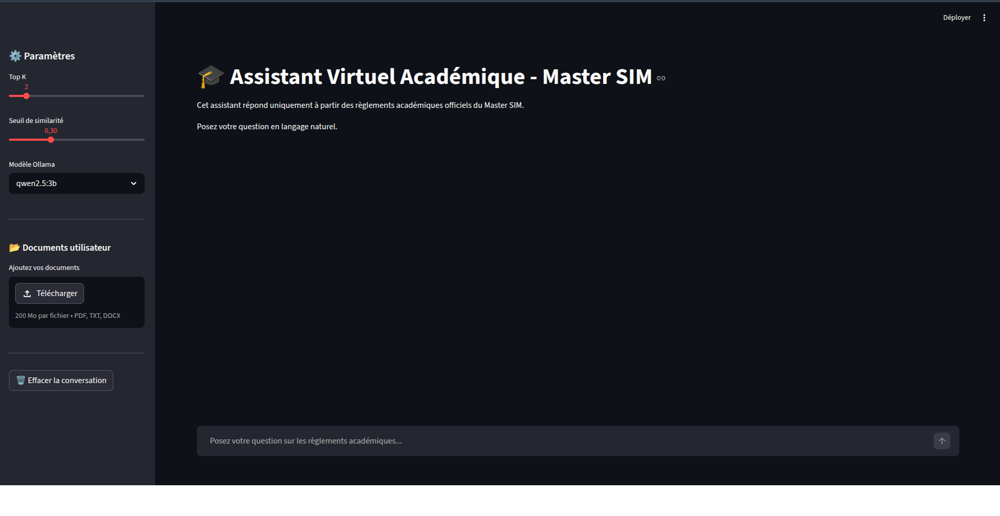

# 🎓 Assistant Virtuel Académique - Master SIM

## 🇫🇷 Version Française

### 📌 Description

Ce projet consiste en la conception d’un assistant virtuel intelligent basé sur les technologies RAG (Retrieval-Augmented Generation) pour aider les étudiants du Master SIM à comprendre les règlements académiques de manière simple et interactive.

Le système permet de :
- interroger des documents académiques en langage naturel,
- rechercher les informations pertinentes,
- générer des réponses pédagogiques en français simple,
- afficher les sources utilisées.

L’assistant utilise des modèles LLM locaux via Ollama ainsi qu’une base vectorielle FAISS.

---

## 🚀 Fonctionnalités

- 📄 Lecture de documents PDF, TXT et DOCX
- 🔍 Recherche sémantique avec FAISS
- 🤖 Génération de réponses avec Ollama
- 💬 Interface conversationnelle avec Streamlit
- 📚 Affichage des sources utilisées
- 📂 Upload de documents utilisateur
- 🧠 Assistant pédagogique en français simple

---

## 🏗️ Architecture du Projet

```text
src/
│
├── main.py            # Interface Streamlit
├── ingest.py          # Ingestion des documents
├── retriever.py       # Recherche sémantique
├── llm_chain.py       # Génération des réponses
├── user_upload.py     # Gestion des documents utilisateur
```

---

## 🛠️ Technologies Utilisées

- Python
- Streamlit
- LangChain
- Ollama
- FAISS
- Qwen2.5
- Sentence Transformers

---

## ⚙️ Installation

### 1. Cloner le projet

```bash
git clone <repo_url>
cd project
```

### 2. Créer un environnement virtuel

```bash
python -m venv .venv
source .venv/bin/activate
```

### 3. Installer les dépendances

```bash
pip install -r requirements.txt
```

### 4. Installer Ollama

https://ollama.com

### 5. Télécharger le modèle

```bash
ollama pull qwen2.5:3b
```

### 6. Lancer Ollama

```bash
ollama serve
```

### 7. Créer la base vectorielle

```bash
python src/ingest.py
```

### 8. Lancer l’application

```bash
streamlit run src/main.py
```

---

## 🧪 Évaluation avec DeepEval

DeepEval est utilisé pour évaluer scientifiquement la qualité du système RAG.
Il ne sert pas à répondre aux étudiants en temps réel ; il sert à mesurer la
qualité du retriever et de la génération sur un jeu de questions de test.

Le fichier d'entrée doit être un fichier CSV ou Excel contenant au minimum une
colonne :

- `Question`

Il peut aussi contenir une colonne optionnelle :

- `Réponse_Attendue`

### Installer DeepEval

```bash
pip install -r requirements.txt
```

### Lancer une évaluation RAG

Avant de lancer l'évaluation avec un juge local, vérifiez que Ollama est actif
et que les modèles nécessaires sont disponibles :

```bash
ollama serve
ollama pull qwen2.5:3b
ollama pull qwen3-embedding
```

```bash
python src/deepeval_evaluation.py \
  --input results/evaluation_rag_resultats_20260608_161244.csv \
  --limit 5 \
  --llm-model qwen2.5:3b \
  --judge-model ollama:qwen2.5:3b
```

Par défaut, le script évalue :

- `Answer Relevancy` : pertinence de la réponse par rapport à la question ;
- `Faithfulness` : fidélité de la réponse au contexte récupéré ;
- `Contextual Relevancy` : pertinence des chunks récupérés.

Pour inclure toutes les métriques disponibles, y compris `Contextual Precision`
et `Contextual Recall` lorsque `Réponse_Attendue` existe :

```bash
python src/deepeval_evaluation.py \
  --input results/evaluation_rag_resultats_20260608_161244.csv \
  --metrics all \
  --judge-model ollama:qwen2.5:3b
```

Les résultats sont exportés dans :

```text
results/deepeval/
```

Une version notebook est aussi disponible pour visualiser les tableaux,
résumés et graphiques :

```text
notebooks/evaluation_deepeval_rag.ipynb
```

Phrase utile pour la soutenance :

> DeepEval est utilisé comme outil d'évaluation hors ligne du système RAG. Il
> permet de mesurer séparément la pertinence des réponses, la fidélité au
> contexte documentaire et la qualité des passages récupérés par FAISS.

---

## 📸 Interface



---

## 🎯 Objectif du Projet

Ce projet a été réalisé dans le cadre d’un stage de Master en Intelligence Artificielle afin de développer un assistant académique intelligent capable d’améliorer l’accès aux règlements universitaires.

---

# 🇬🇧 English Version

## 📌 Description

This project consists of building an intelligent virtual assistant based on Retrieval-Augmented Generation (RAG) technologies to help Master SIM students better understand academic regulations through natural language interaction.

The system is able to:
- answer questions from academic documents,
- retrieve relevant information,
- generate pedagogical answers in simple French,
- display the sources used.

The assistant uses local LLMs through Ollama and a FAISS vector database.

---

## 🚀 Features

- 📄 PDF, TXT and DOCX document support
- 🔍 Semantic search using FAISS
- 🤖 Answer generation with Ollama
- 💬 Conversational interface with Streamlit
- 📚 Source citation display
- 📂 User document upload
- 🧠 Educational assistant in simple French

---

## 🏗️ Project Architecture

```text
src/
│
├── main.py            # Streamlit interface
├── ingest.py          # Document ingestion
├── retriever.py       # Semantic retrieval
├── llm_chain.py       # Answer generation
├── user_upload.py     # User document management
```

---

## 🛠️ Technologies Used

- Python
- Streamlit
- LangChain
- Ollama
- FAISS
- Qwen2.5
- Sentence Transformers

---

## ⚙️ Installation

### 1. Clone the repository

```bash
git clone <repo_url>
cd project
```

### 2. Create virtual environment

```bash
python -m venv .venv
source .venv/bin/activate
```

### 3. Install dependencies

```bash
pip install -r requirements.txt
```

### 4. Install Ollama

https://ollama.com

### 5. Download model

```bash
ollama pull qwen2.5:3b
```

### 6. Start Ollama

```bash
ollama serve
```

### 7. Build vector database

```bash
python src/ingest.py
```

### 8. Run application

```bash
streamlit run src/main.py
```

---

## 🧪 Evaluation with DeepEval

DeepEval is used to scientifically evaluate the RAG system quality. It is not
used to answer students in real time; it is used offline to measure retrieval
and generation quality on a test question set.

The input file must be a CSV or Excel file with at least:

- `Question`

It can also include:

- `Réponse_Attendue`

### Install DeepEval

```bash
pip install -r requirements.txt
```

### Run a RAG evaluation

Before running the evaluation with a local judge, make sure Ollama is running
and the required models are available:

```bash
ollama serve
ollama pull qwen2.5:3b
ollama pull qwen3-embedding
```

```bash
python src/deepeval_evaluation.py \
  --input results/evaluation_rag_resultats_20260608_161244.csv \
  --limit 5 \
  --llm-model qwen2.5:3b \
  --judge-model ollama:qwen2.5:3b
```

Results are exported to:

```text
results/deepeval/
```

Notebook version:

```text
notebooks/evaluation_deepeval_rag.ipynb
```

---

## 📸 Interface


---

## 🎯 Project Objective

This project was developed as part of a Master's internship in Artificial Intelligence to create an intelligent academic assistant capable of improving access to university regulations.
